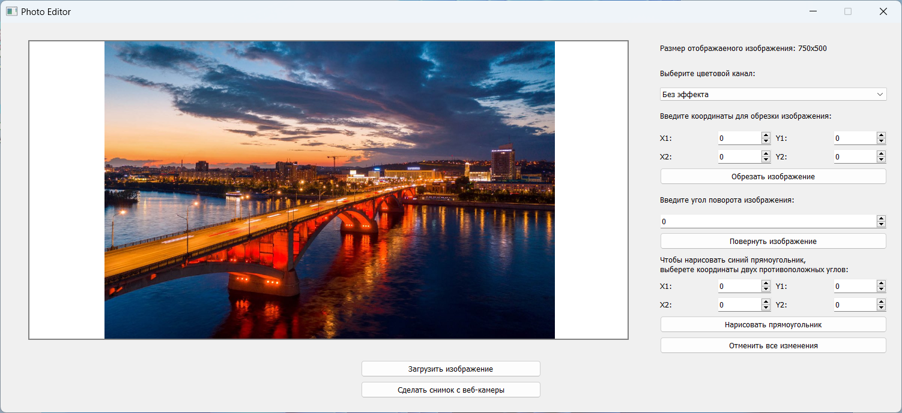
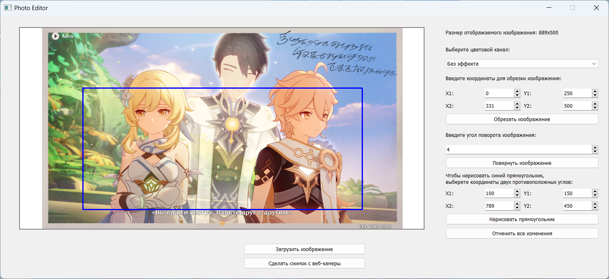

  <h3 align="center">Простой фоторедактор</h3>

## О проекте

Приложения для обработки изображений, разработаное в рамках летней практики на первом курсе.
Функционал:

* Кадрирование по координатам
* Поворот на угол x
* Смена цветового канала
* Отрисовка фигуры поверх изображения
* Возможность сделать снимок с веб камеры

    
    

## Установка

1. Загрузите архив, распакуйте, откройте командную строку, перейдите в корневую папку программы

2. Создайте виртуальное окружение для Python 3.7 и установите зависимости, например, с помощью Conda, для этого в командной строке выполните:
   
         conda create -n env_name -y python=3.7
    
         conda activate env_name
   
         pip install -r requirements.txt

4. Запустите приложение, выполнив команду
         python photo_editor.py
